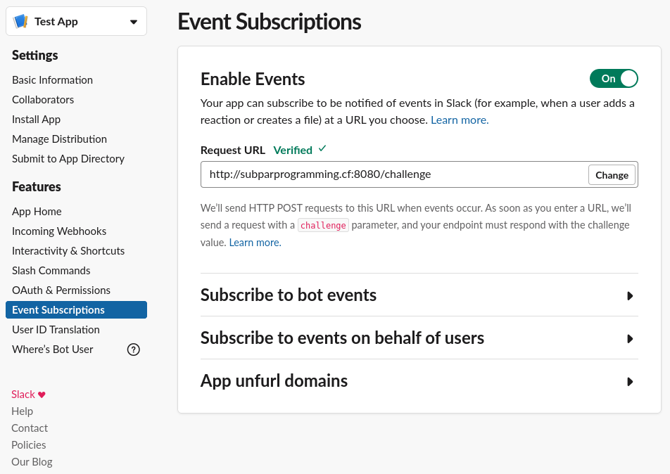

# Slack url_verification
an express app to handle the Slack url_verification event

_tested on: node v10.21.0, npm v6.14.4, express v4.17.1_

### Instructions:
  1) place challenge.js in an empty directory
  2) cd into the new directory
  3) $ npm install express
  4) $ node challenge.js
  5) in Slack verify the Request URL: http://server.url:port/challenge
  
url_verification event API: https://api.slack.com/events/url_verification

